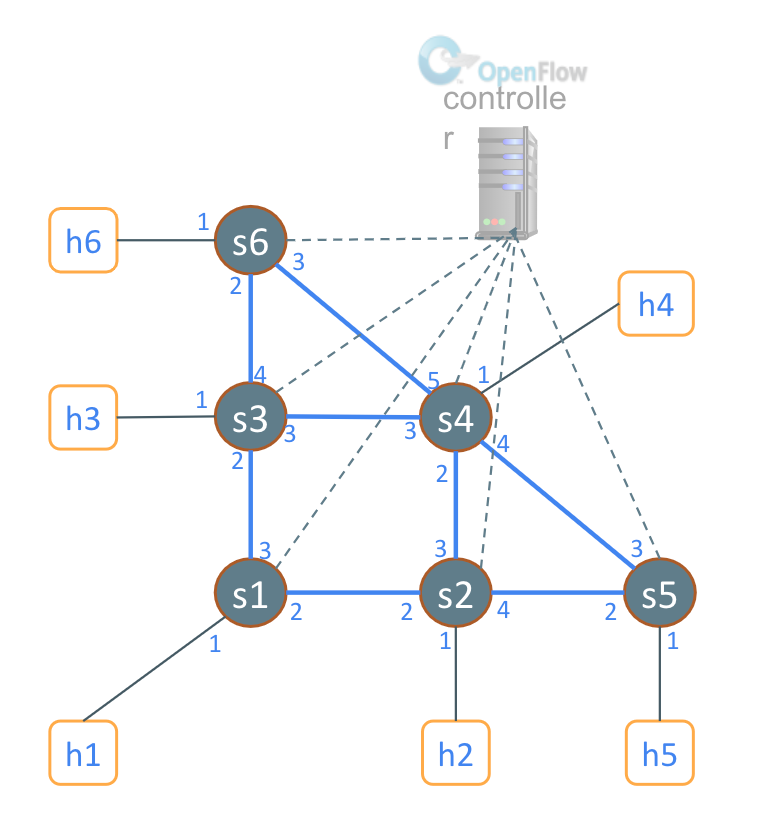
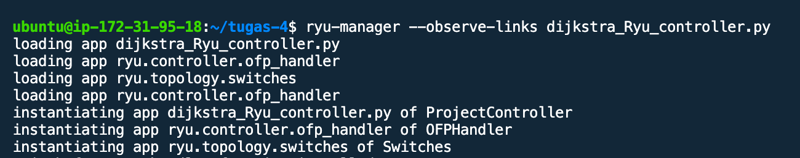
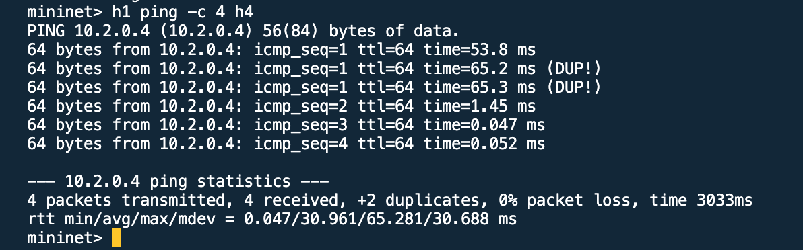
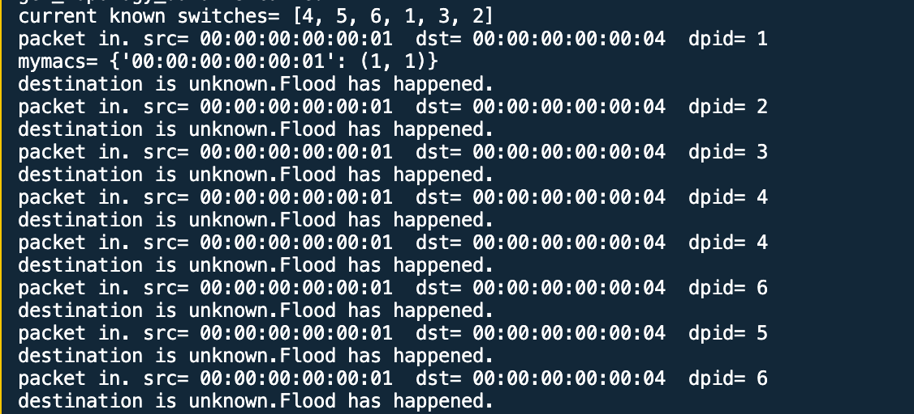
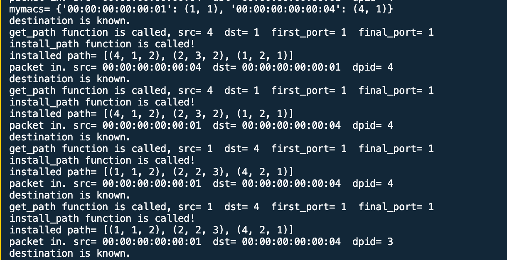
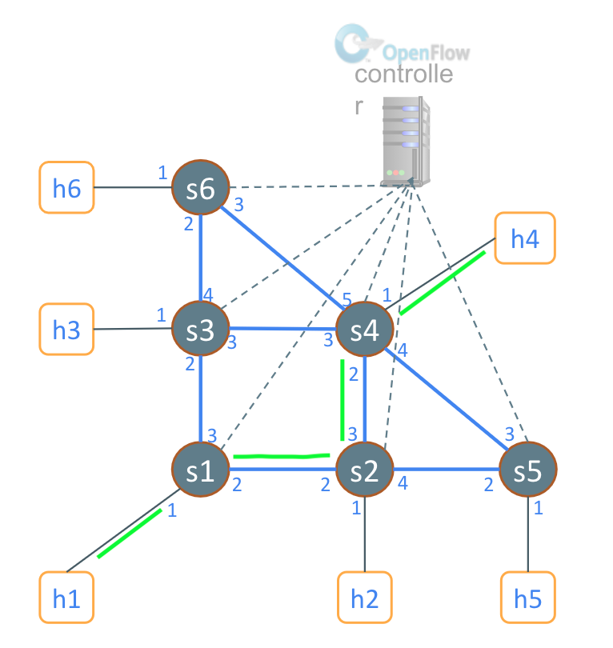

# SDN---Shortest-Path-Route
dijkstra algorithm at SDN Ryu

RYU monitoring to find out the shortest route using the dijkstra method. The topology used is as follows.


Run the ryu's program. The “—observe-links” command is used to observe and find out the position of each switch connected to each other, including to detect the host.
```
ryu-manager —observe-links dijkstra_Ryu_controller.py
```


Run topology program
```
sudo python3 topo-spf_lab.py
```
ping H1 to 44


Check RYU monitoring. An incoming packet occurs from host 1 (source) to destination (destination) host 4. dpid is the switch used. packets will broadcast to all switches to know which paths can be traversed.


The process will get results where the destination is on switch 4 port 1 which is host 4. After the destination is found, the h1 process will occur to determine by iteration until the shortest path is found from the path that has been found.


The path found is from Switch 1 port 1 to port 2 → Switch 2 port 2 to port 3 → Switch 4 port 2 to port 1.


